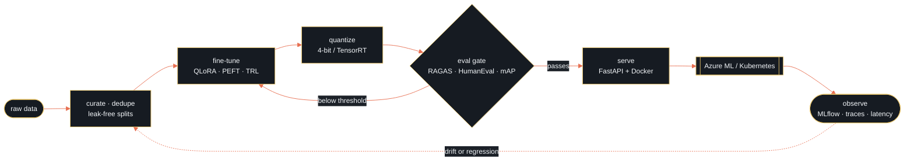

 

&nbsp;
&nbsp;
&nbsp;
&nbsp;

 

> ### Open to AI / ML Engineer roles
> **Generative AI · LLM Engineering · MLOps · Machine Learning** — full-time, Mumbai or remote.
> If you're shipping an AI product that has to keep working *after* the demo, I'd like to hear about it.
> [**Start a conversation →**](https://www.linkedin.com/in/nikhilsatyawanpatil/)

 

**01**
##  Who I am

I'm an AI/ML Engineer in Mumbai who builds **generative AI systems that hold up in production** — retrieval and agent pipelines that are evaluated rather than eyeballed, fine-tuned open models that fit real hardware budgets, and the MLOps scaffolding that keeps both reproducible.

My bias is toward the unglamorous half of the work: evaluation harnesses, tracing, caching, guardrails, and deploy pipelines. A model that scores well once is a demo. A model you can re-train, re-measure, and roll back is a product.

<table>
<tr><td width="120"><b>GENERATIVE&nbsp;AI</b></td><td>Multi-agent RAG with LangGraph · semantic search &amp; reranking · RAGAS evaluation · guardrails · streaming</td></tr>
<tr><td><b>FINE-TUNING</b></td><td>QLoRA · PEFT · TRL on Gemma 4 and Llama 3.2 · leak-free dataset splits · HumanEval-style benchmarking</td></tr>
<tr><td><b>MLOPS</b></td><td>Azure ML · MLflow tracking &amp; registry · Docker · Kubernetes · FastAPI · reproducible training pipelines</td></tr>
<tr><td><b>ALSO</b></td><td>Production computer vision — YOLO + TensorRT deployment, 500K-image dataset curation</td></tr>
</table>

 

**02**
##  By the numbers

|  |  |  |
|:--|:--|:--|
| **10,000+**   document embeddings indexed | **4 agents**   orchestrated in one graph | **&lt;3 sec**   end-to-end query resolution |
| **5,000**   curated SFT samples | **2 models**   fine-tuned on a single GPU | **500K+**   images curated &amp; labelled |

 

**03**
##  Selected work

<table>
<tr>
<td width="50%" valign="top">

#### Agentic AI Research Assistant
`Generative AI` · `RAG` · `Evaluation`

A production multi-agent RAG system — four specialized agents chained **research → retrieval → fact-check → synthesis**, with the whole path instrumented.

10,000+ embeddings · semantic search with reranking · RAGAS scoring · Redis caching · WebSocket streaming · guardrails · MLflow tracking

`LangGraph` `RAGAS` `FastAPI` `Redis` `ChromaDB` `Docker`

[**Open repository →**](https://github.com/NAME-NikhilPatil/agentic-ai-research-assistant)

</td>
<td width="50%" valign="top">

#### Gemma 4 · Instruction Tuning
`Fine-tuning` · `QLoRA` · `Data curation`

Fine-tuned **Gemma 4 E2B IT** with QLoRA + PEFT to turn a bare topic into a tight, hook-first short-form script.

5,000 samples · **leak-free grouped splits** · automated cleaning · conversational JSONL generation · reproducible eval

`Gemma 4` `QLoRA` `PEFT` `TRL` `Transformers`

[**Open repository →**](https://github.com/NAME-NikhilPatil/gemma4-e2b-tech-shorts-finetuning)

</td>
</tr>
<tr>
<td width="50%" valign="top">

#### Llama 3.2 · Code Generation
`Fine-tuning` · `Benchmarking`

Fine-tuned **Meta Llama 3.2 1B** with 4-bit QLoRA on a single **Tesla T4** — then held it to HumanEval `pass@1` and `pass@10` instead of cherry-picked samples.

`Llama 3.2` `PyTorch` `TRL` `HumanEval` `bitsandbytes`

[**Open repository →**](https://github.com/NAME-NikhilPatil/Llama-3.2-1B)

</td>
<td width="50%" valign="top">

#### Retail Vision Pipeline
`MLOps` · `Computer vision` · `Deployment`

End-to-end CV deployment: 500K-image curation → YOLO training → TensorRT compilation → containerized inference on constrained hardware, cutting checkout time ~30%.

`YOLO` `TensorRT` `ONNX` `OpenCV` `Docker`

[**Browse all repositories →**](https://github.com/NAME-NikhilPatil?tab=repositories)

</td>
</tr>
</table>

 

**04**
##  How a model gets to production

 

**05**
##  Toolkit

| | |
|:--|:--|
| **Generative AI** | `LangGraph` `LangChain` `Transformers` `PEFT` `TRL` `bitsandbytes` `vLLM` |
| **Retrieval** | `ChromaDB` `FAISS` `RAGAS` `Redis` `sentence-transformers` |
| **ML & Vision** | `Python` `PyTorch` `TensorFlow` `Keras` `scikit-learn` `OpenCV` `ONNX` `TensorRT` |
| **MLOps & Cloud** | `Azure ML` `MLflow` `Docker` `Kubernetes` `FastAPI` `GitHub Actions` `Git` |
| **Data** | `NumPy` `Pandas` `PostgreSQL` `MySQL` |

 

**06**
##  What I'm working on now

**Evaluation-first agents** — treating RAGAS scores, traces, and regression suites as release gates rather than dashboards.
**Small-model economics** — how far QLoRA on compact open models gets you before a frontier API is worth the bill.
**Reproducible pipelines** — one command from raw data to a registered, versioned, rollback-able model.
**Serving efficiency** — quantization, batching, and caching, so latency and cost survive real traffic.

 

**07**
##  Activity

 

  

· · ·

 

**Let's build something that survives contact with production.**

[LinkedIn](https://www.linkedin.com/in/nikhilsatyawanpatil/) · [Email](mailto:nikhilsatyawanpatil@gmail.com) · [YouTube](https://www.youtube.com/channel/UCpakmXio90uAd4RBZqimG8Q) · [Instagram](https://www.instagram.com/nikhilpatil.ai/)

