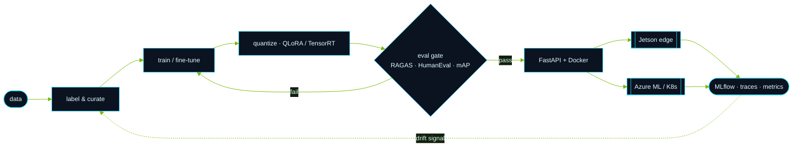

<div align="center">


<br />

<a href="https://www.linkedin.com/in/nikhilsatyawanpatil/"></a>
<a href="mailto:nikhilsatyawanpatil@gmail.com"></a>
<a href="https://www.youtube.com/channel/UCpakmXio90uAd4RBZqimG8Q"></a>
<a href="https://www.instagram.com/nikhilpatil.ai/"></a>


</div>

> [!TIP]
> **Open to AI/ML Engineer roles.** If you're shipping an AI product that has to work *after* the demo — computer vision at the edge, agentic RAG, or model optimization — let's talk.

---

## `01 · WHOAMI`

```yaml
nikhil:
  role:      AI/ML Engineer
  based_in:  Mumbai, India
  builds:    computer vision · edge AI · generative AI systems
  obsessed_with:
    - squeezing real-time inference out of small hardware
    - agents you can actually measure, trace and trust
    - fine-tuning compact open models on a single GPU
  ships_with:  Azure ML · MLflow · Docker · Kubernetes · FastAPI
  measures_in: latency, throughput, and business impact
```

---

## `02 · TELEMETRY`

<div align="center">

<table>
<tr>
<td align="center" width="16.6%"><br /><sub>retail images<br />curated</sub></td>
<td align="center" width="16.6%"><br /><sub>edge inference<br />throughput</sub></td>
<td align="center" width="16.6%"><br /><sub>inference<br />latency</sub></td>
<td align="center" width="16.6%"><br /><sub>faster checkout<br />processing</sub></td>
<td align="center" width="16.6%"><br /><sub>RAG<br />orchestration</sub></td>
<td align="center" width="16.6%"><br /><sub>query<br />resolution</sub></td>
</tr>
</table>

</div>

---

## `03 · BUILDS`

<table>
<tr>
<td width="50%" valign="top">

### 🧠 Agentic AI Research Assistant

A production multi-agent RAG system: four specialized agents for **research → retrieval → fact-check → synthesis**.

`10,000+` embeddings · semantic search + reranking · RAGAS eval · Redis caching · WebSocket streaming · guardrails · MLflow


<a href="https://github.com/NAME-NikhilPatil/agentic-ai-research-assistant"></a>

</td>
<td width="50%" valign="top">

### 🎬 Gemma 4 · Tech Shorts Writer

Fine-tuned **Gemma 4 E2B IT** with QLoRA + PEFT to turn a topic into a tight, hook-first Shorts script.

`5,000` scripts · leak-free grouped splits · automated cleaning · conversational JSONL · reproducible eval


<a href="https://github.com/NAME-NikhilPatil/gemma4-e2b-tech-shorts-finetuning"></a>

</td>
</tr>
<tr>
<td width="50%" valign="top">

### 💻 Llama 3.2 · Python Code Gen

Fine-tuned **Meta Llama 3.2 1B** with 4-bit QLoRA on a single **Tesla T4** — then held it to HumanEval `pass@1` / `pass@10` instead of vibes.


<a href="https://github.com/NAME-NikhilPatil/Llama-3.2-1B"></a>

</td>
<td width="50%" valign="top">

### 👁️ Retail Vision at the Edge

Optimized **YOLO** detection compiled to **TensorRT** and deployed on **NVIDIA Jetson** — a smart-cart pipeline running `60+ FPS` at `<50 ms`, cutting checkout time ~`30%`.


<a href="https://github.com/NAME-NikhilPatil?tab=repositories"></a>

</td>
</tr>
</table>

---

## `04 · HOW I SHIP IT`



---

## `05 · STACK`

<table>
<tr><td><b>🧠 ML &amp; Vision</b></td><td>


</td></tr>
<tr><td><b>✨ GenAI &amp; Retrieval</b></td><td>


</td></tr>
<tr><td><b>⚙️ MLOps &amp; Cloud</b></td><td>


</td></tr>
<tr><td><b>📊 Data</b></td><td>


</td></tr>
</table>

---

## `06 · CURRENTLY`

```console
$ nikhil --status
[▓▓▓▓▓▓▓▓▓░] faster edge inference for real-world computer vision
[▓▓▓▓▓▓▓░░░] agentic systems with eval, tracing, caching & safety rails
[▓▓▓▓▓░░░░░] practical fine-tuning recipes for compact open models
[▓▓▓░░░░░░░] AI products aimed at visible customer & business problems
```

---

## `07 · ACTIVITY`

<div align="center">


<br /><br />


</div>

---

<div align="center">

## `08 · LET'S BUILD`

Computer vision · edge AI · generative AI · RAG · model optimization · production MLOps

<a href="https://www.linkedin.com/in/nikhilsatyawanpatil/"></a>

<br /><br />

<code>// building AI that survives contact with the real world ⚡</code>


</div>

